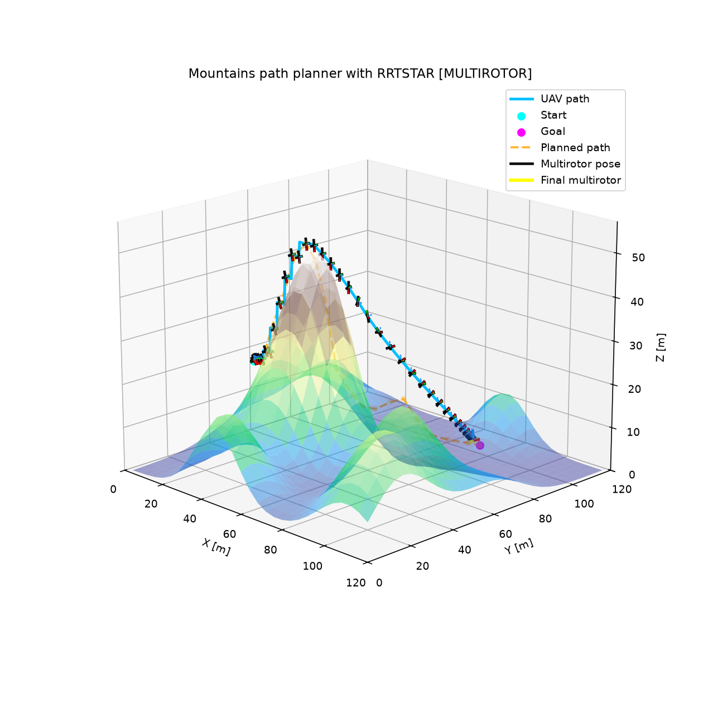
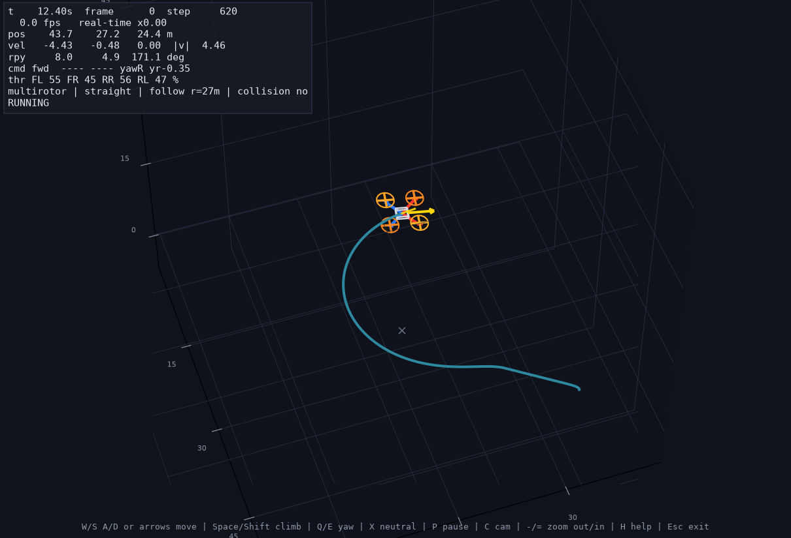
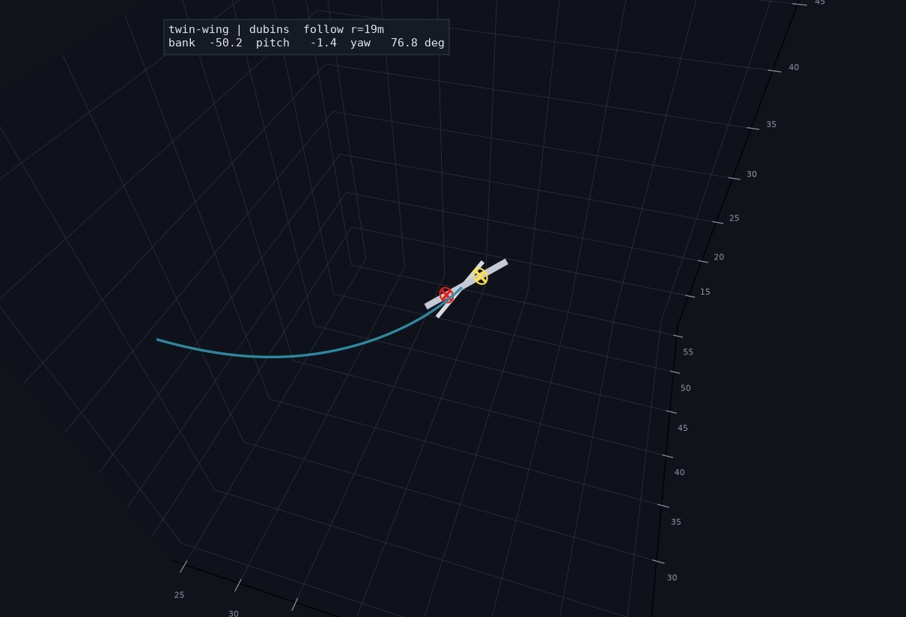

# aerial-kit

**UAS Controller, Planner, Simulator, Firmware** — a control, planning, simulation, and
radio-link stack for **aerial robots**. Alongside the ROS 2 / Python control stack, this
repo carries fully custom ESP32 flight-link firmware (ESP-NOW, ELRS, LoRa, GPS) — custom
multirotor firmware is being added here too, alongside the existing links. The shared,
ROS-free control layer is also published standalone on PyPI as
[`aerial-kit`](https://pypi.org/project/aerial-kit/) (`pip install aerial-kit`).
Optional standalone simulation and visualization are available with
`pip install "aerial-kit[sim]"`.

- **Controller**: ROS 2 control + safety pipeline (hardware + Gazebo Sim / fast sim), plus
  a standalone `aerial_kit` package (PID / LQR / MPC, L1 + TECS for fixed wing)
- **Planner**: straight / A* / RRT / RRT* / Dubins path planners
- **Simulator**: standalone Python simulator (no ROS) for fast iteration on planners/
  controllers, plus ROS 2 + Gazebo simulation
- **Firmware**: ESP32 firmware (ESP-NOW, ELRS, LoRa, GPS) for manual flight + autonomous
  command relay, plus autopilot bridges for PX4, ArduPilot, and Betaflight

## What's in this repo

- **Controllers**
  - **ROS 2**: PID / LQR / MPC (work-in-progress depending on package)
  - **Python-only** (`sim_py`): PID / LQR / MPC position controllers + Matplotlib teleop
- **Path planning (Python-only)**: straight / A* / RRT planners
- **Terrain generation**: forest / mountains / plains (shared between ROS and Python sim)
- **Safety**: validation, limiting, watchdog (`safety_gate`)
- **Hardware link**: CRSF adapter + ESP-NOW / ELRS TX/RX + protocol bridging
- **Autopilot bridges**: MAVLink (PX4 / ArduPilot) and CRSF (Betaflight)

## Demo

See [Supported airframes](#supported-airframes) for what else is in progress.

### Python Sim & ROS2 Gazebo Sim

Autonomous flight — plan a path, then fly it:

<table>
  <tr>
    <td width="50%" align="center"></td>
    <td width="50%" align="center"></td>
  </tr>
  <tr>
    <td valign="top"><em>RRT* through forest terrain on the RotorPy backend.</em></td>
    <td valign="top"><em>RRT* over mountains — the planner climbs a 47 m ridge to reach the goal. Planned path dashed in orange, flown trajectory in cyan.</em></td>
  </tr>
</table>

Standalone Python sim (Matplotlib 3D, follow camera):

<table>
  <tr>
    <td width="50%" align="center"></td>
    <td width="50%" align="center"></td>
  </tr>
  <tr>
    <td valign="top"><em>Native multirotor backend — a 56 m climbing turn, teal trail showing where it has flown. Each propeller is coloured by thrust (grey idle → yellow → orange → red).</em></td>
    <td valign="top"><em><a href="examples/fixed_wing">Twin-wing example</a> on the same renderer — banked 50° through the turn, flown path behind it, motors on the same colour map.</em></td>
  </tr>
</table>

<p>
  
</p>

### Hovering & Landing (IMU + Barometer + GPS)

https://github.com/user-attachments/assets/44837663-b281-45db-9803-5aaa9812833d

*Autonomous hover and landing, commanded over the CRSF/ESP-NOW link. The state estimate fuses IMU
attitude, barometric altitude, and GPS position.*

## Supported airframes

| Airframe | Simulation | Control |
|----------|-----------|---------|
| Quadcopter | ✅ Working | ✅ PID / LQR / MPC |
| Hexacopter | ✅ Mixer verified | ✅ PID / LQR / MPC |
| Octacopter | ✅ Mixer verified | ✅ PID / LQR / MPC |
| Twin-motor wing | 🚧 6-DOF backend | 🚧 L1/TECS guidance |
| Single-motor wing | ⏳ To be added | ⏳ To be added |
| Monocopter | ⏳ To be added | ⏳ To be added |
| TVC (thrust-vectored) | ⏳ To be added | ⏳ To be added |

Quadcopter is the reference airframe. The twin-wing example in the demos uses the native
6-DOF fixed-wing backend. Pieces that are still quad-shaped today are the `rotorpy`
dynamics backend, the `hover_throttle` / velocity-to-stick mapping in `hw_bridge`, and
the Gazebo `x3` / `lr_drone` models. Lifting those into a shared airframe layer is the
active line of work; see [Roadmap](#roadmap).

## Autopilot & firmware support

| Platform | Link | Package | Status |
|----------|------|---------|--------|
| Betaflight | CRSF over ESP-NOW/UDP relay | `ros2_ws/src/hw_bridge` (`crsf_backend_adapter_node`) | ✅ Working |
| PX4 | MAVLink over USB / UART / telemetry radio | `ros2_ws/src/mavlink_bridge` | ✅ Working |
| ArduPilot | MAVLink, same node (`flight_stack: ardupilot`) | `ros2_ws/src/mavlink_bridge` | 🚧 Supported, in testing |
| Custom firmware (this repo) | ESP-NOW + CRSF, 2.4 GHz SX1280 ELRS, LoRa telemetry | `firmware/` | ✅ Working |

All autopilot backends implement the same `/uav/backend/*` contract as the simulation
adapters, so the mission and control stack above them is unchanged between sim, Betaflight,
and PX4/ArduPilot.

## Architecture (high level)

**Manual Flight**

```
TX (IMU+Joystick) -> ESP-NOW -> RX -> Protocol Bridge -> Flight Controller
                                      (CRSF/SBUS/PPM/iBus/FrSky)
```

**Autonomous (Hardware-in-the-loop)**

```
/uav/backend/cmd_twist + /uav/backend/enable
    -> hw_bridge (crsf_backend_adapter_node)      -> Betaflight over CRSF/ESP-NOW
     | mavlink_bridge (mavlink_bridge_node)       -> PX4 / ArduPilot over MAVLink

FC sensors (/uav/hw/imu, /uav/hw/baro, /uav/hw/gps)
    -> hw_state_estimator_node
    -> /uav/backend/odom
    -> telemetry_adapter_node -> /uav/backend/telemetry_raw
```

**Simulation**

- **ROS 2 (Gazebo / fast sim)**:

```
Ground Station / Air Unit -> sim_bridge -> Gazebo Sim (or sim_fast)
```

- **Python-only (no ROS)**:

```
Planner -> Controller -> Dynamics backend (pointmass/rotorpy) -> Matplotlib 3D
```

## Quick start (Python-only simulator)

Published-package API and examples:

```bash
python -m pip install -e ".[sim]"
python examples/quadrotor/run.py
python examples/fixed_wing/run.py

# Real-time keyboard control -- works from a fresh clone, no install needed
python examples/quadrotor/teleop.py    # W/S A/D or arrows to move, Space/Shift to climb, Q/E to yaw
python examples/fixed_wing/teleop.py   # W/S to pitch, A/D to bank, Space/Shift for throttle
# Esc exits either one. If you did the pip install above and its Scripts
# directory is on PATH, the short forms also work: aerial-kit-teleop,
# aerial-kit-teleop --airframe fixed-wing

# Headless runs that save plots
python examples/quadrotor/run.py --no-show --save quadrotor-result.png
python examples/fixed_wing/run.py --no-show --save fixed-wing-result.png
```

The example YAML files document vehicle, dynamics, controller, path, initial-state,
and visualization parameters. The legacy source-tree entry point remains available:

```bash
./scripts/setup_sim_py_venv.sh
source sim_py/.venv/bin/activate
python -m sim_py.run_sim
```

Optional RotorPy backend:

```bash
./scripts/setup_sim_py_venv.sh --with-rotorpy
source sim_py/.venv/bin/activate
python -m sim_py.run_sim --backend rotorpy
```

Useful overrides:

```bash
# Switch controller
python -m sim_py.run_sim --controller mpc

# Switch path planner (straight | astar | rrt | rrtstar | dubins)
python -m sim_py.run_sim --planner rrtstar --terrain mountains

# Change terrain type (still uses the terrain config YAML unless overridden)
python -m sim_py.run_sim --terrain forest

# Override sim time / dt (if you pass these, they override sim_config.yaml)
python -m sim_py.run_sim --sim-time 240 --dt 0.01

# Use a different terrain config file
python -m sim_py.run_sim --terrain-config ros2_ws/src/terrain_generator/config/terrain_params.yaml

# Select dynamics backend (default: pointmass)
python -m sim_py.run_sim --backend rotorpy

# Interactive teleop from the legacy entry point
python -m sim_py.run_sim --controller teleop --backend multirotor --terrain forest
```

### Teleop (real-time keyboard control)

Works from a fresh clone, no install required:

```bash
python examples/quadrotor/teleop.py     # quadrotor
python examples/fixed_wing/teleop.py    # fixed wing
```

or, from the repository root: `python -m aerial_kit.sim.teleop` (add
`--airframe fixed-wing` for the wing). If you ran `pip install -e ".[sim]"`
**and** the Python Scripts directory that installs into is on your `PATH`, the
short console-script forms also work: `aerial-kit-teleop`,
`aerial-kit-teleop --airframe fixed-wing`, or `aerial-kit-sim --teleop` /
`aerial-kit-sim --example fixed-wing --teleop`. If a short form prints
`'aerial-kit-teleop' is not recognized`, that `PATH` condition is what's
missing — the `python -m`/script forms above need neither the install nor
`PATH` and always work.

**Quadrotor** — drone-style controls:

| Key | Action |
| --- | --- |
| `W` / `S` or `Up` / `Down` | forward / backward |
| `A` / `D` or `Left` / `Right` | strafe left / right |
| `Space` / `Shift` | climb / descend |
| `Q` / `E` | yaw left / right |

**Fixed wing** — RC-plane-style controls (the wing has no rudder, so `Q`/`E`
biases differential thrust rather than yawing directly):

| Key | Action |
| --- | --- |
| `W` / `S` or `Up` / `Down` | pitch: dive / climb |
| `A` / `D` or `Left` / `Right` | bank: turn right / left |
| `Space` / `Shift` | throttle up / down |
| `Q` / `E` | differential-thrust yaw nudge |

Shared, both airframes:

| Key | Action |
| --- | --- |
| `X` | neutralize all commands |
| `P` | pause / resume |
| `C` | toggle follow / world camera |
| `-` / `=` | zoom the follow camera out / in |
| `H` | hide the on-screen help |
| `Esc` | exit |

Controls are body-relative: forward follows the nose, so yawing with `Q`/`E`
changes where `W` takes you. Click the plot window first — the HUD says
`NO FOCUS` when keystrokes are not reaching it, and held keys are dropped
whenever the window loses focus.

The follow camera is a third-person chase view: it stays behind the vehicle
and turns with its heading, low and close, rather than watching from a fixed
compass bearing or an overhead survey angle. Press `C` for a top-down world
view instead. The HUD reports simulation time, frame count, render rate,
real-time factor, position, velocity, roll/pitch/yaw, the current control
inputs, per-motor thrust, backend, run state, focus state and collision
state. Propellers/motors tint from cool idle to hot full thrust. Physics runs
at a fixed step against `time.monotonic()`, so the simulation stays at 1.0x
real time regardless of the achieved frame rate.

The fixed wing's aero model is a small-angle approximation with no rate
limiter of its own; a sustained extreme input (holding full aileron for
several seconds, say) can drive it into a regime the model was never fit for
and the integration diverges. The engine detects this and freezes rather than
crashing the window — the HUD reports `CRASHED` and Esc still exits cleanly.

Tuning lives under `controller.teleop` / `controller.teleop_fixedwing`
(accelerations/damping/speed limits for the quad; throttle and elevon
authority for the wing) and `visual.teleop_*` (view radius, model scale, grid
spacing) in `examples/quadrotor/config.yaml` and
`aerial_kit/sim/defaults/fixed_wing.yaml` respectively.

### Python sim configuration

- **Main config**: `sim_py/sim_config.yaml`
  - **Start/goal**: `path.start_relative_*`, `path.end_relative_*`
    - `end_relative_z: "auto"` picks a random goal altitude in \([0, \text{tallest tree}]\)
  - **Planner**: `path.planner_type` = `straight` | `astar` | `rrt` | `rrtstar` | `dubins`
    (CLI `--planner` overrides)
  - **Runtime**: `controller.sim_time`, `controller.dt`
  - **Backend**: `simulation.backend` = `pointmass` | `rotorpy` (CLI `--backend` overrides)
  - **Terrain appearance / scaling**:
    - `visual.forest_density_scale`: scales forest density (clamped to 1.0)
    - `visual.tree_height_scale`: scales sampled tree heights
    - `visual.height_ratio`: sets map height as `height_ratio * tallest_tree`
    - `visual.tree_radius_ref`: reference radius for drawing thicker/thinner trunks

- **Terrain config** (shared with ROS):
  - `ros2_ws/src/terrain_generator/config/terrain_params.yaml`
  - Forest obstacle count is mainly set by:
    - `forest.grid_size` and `forest.density`
    - expected trees ~= \(grid\_size^2 \cdot density\)

## Quick start (ROS 2)

### Gazebo / Ground-Air stack (current)

The rebuilt Gazebo + ground-station / air-unit stack now lives in `ros2_ws`.

- Workspace docs / runbook: `ros2_ws/README.md`
- Primary sim bringup: `ros2 launch sim_gazebo bringup.launch.py`
- Ground station bringup: `ros2 launch ground_station ground.launch.py`

### Hardware autonomous flight

CRSF/Betaflight backend launch:

```bash
cd ros2_ws
source install/setup.bash
ros2 launch hw_bridge hw_crsf.launch.py udp_host:=192.168.4.1
```

PX4 / ArduPilot MAVLink backend launch:

```bash
# Direct MAVLink to the flight controller (USB / UART / telemetry radio).
# Defaults come from mavlink_bridge/config/mavlink_bridge_default.yaml.
ros2 launch mavlink_bridge real_hardware.launch.py

# To change connection_url / baud / flight_stack ("px4" or "ardupilot"),
# copy that YAML and point the launch at it:
ros2 launch mavlink_bridge real_hardware.launch.py \
    mavlink_bridge_params_file:=/path/to/my_vehicle.yaml

# SITL / UDP via the older hw_bridge adapter
ros2 launch hw_bridge hw_px4.launch.py mavlink_url:=udpin:0.0.0.0:14540
```

Wiring and parameter details: `ros2_ws/src/mavlink_bridge/README.md`.

Sensor topic contract for hardware estimation:
- `/uav/hw/imu` (`sensor_msgs/msg/Imu`)
- `/uav/hw/baro` (`std_msgs/msg/Float64`, meters)
- `/uav/hw/gps` (`sensor_msgs/msg/NavSatFix`)

Bring-up and TX integration details are in `docs/HARDWARE.md`.

**Before real flight:** tune `hover_throttle` and mapping gains per airframe, and keep Betaflight in **Angle mode** for the velocity-to-stick mapping used by `hw_bridge`.

### Build

```bash
cd ros2_ws
colcon build --symlink-install
source install/setup.bash
```

### Run Gazebo / Fast simulation

```bash
ros2 launch sim_gazebo bringup.launch.py
ros2 launch ground_station ground.launch.py

# Fast headless backend
ros2 launch sim_fast bringup.launch.py
```

For the current tested Gazebo + terrain + planner demo commands (including dense forest and path visualization), use:
- `ros2_ws/README.md` -> `Recommended Test Flows (Current)`

### Legacy ROS2 prototype scripts

The old RViz/controller prototype workspace was replaced during consolidation.
If you still need the legacy PID/LQR/MPC ROS2 stack, recover it from git history.
Current ROS2 workflows are documented in `ros2_ws/README.md`.

## Docker quick start
Dockerfiles are split by workflow:

- ROS 2 Humble: `docker/Dockerfile.humble`
- Python simulator/tools: `docker/Dockerfile.sim`
- Firmware tooling (PlatformIO): `docker/Dockerfile.firmware`

Build and run:

```bash
# ROS 2 image
docker build -f docker/Dockerfile.humble --target ros-dev -t uav-controller:ros-humble .
docker run --rm -it --network=host --privileged -v "$PWD":/workspace uav-controller:ros-humble

# sim_py + Python tools image
docker build -f docker/Dockerfile.sim -t uav-controller:sim .
docker run --rm -it -v "$PWD":/workspace uav-controller:sim

# firmware / PlatformIO image
docker build -f docker/Dockerfile.firmware -t uav-controller:firmware .
docker run --rm -it -v "$PWD":/workspace uav-controller:firmware
```

More details: `docker/README.md`.

## GPS module (ESP32)

The `firmware/gps/` project is an ESP32 GPS bring-up/telemetry module using `Adafruit_GPS`.

- Supports PMTK/NMEA modules (Adafruit Ultimate GPS / MTK33xx style)
- Supports u-blox modules with UBX configuration (while parsing NMEA output)
- Auto-probes common UART baud rates (9600/38400/115200), parses fix/satellite/SNR metrics, and prints diagnostics over serial
- Build/flash protocol options:
  - `pio run -d firmware/gps -e gps_auto -t upload` (AUTO detect PMTK vs UBLOX)
  - `pio run -d firmware/gps -e gps_pmtk -t upload` (force PMTK mode)
  - `pio run -d firmware/gps -e gps_ublox -t upload` (force UBLOX mode)

The host-side live dashboard is `tools/gps_dashboard.py` (see `tools/GPS_DASHBOARD.md`).


## Packages / folders

| Path | Type | Purpose |
|------|------|---------|
| `ros2_ws/src/air_unit` | Python | Air-side command manager / mission executor / telemetry adapter |
| `ros2_ws/src/ground_station` | Python | CLI, monitor, and demo mission tools |
| `ros2_ws/src/planner` | Python | ROS2 planner service wrapper for `sim_py` planners |
| `ros2_ws/src/sim_bridge` | Python | Backend adapters (Gazebo / fast sim) |
| `ros2_ws/src/hw_bridge` | Python | Hardware backend adapters + estimator (CRSF/Betaflight) |
| `ros2_ws/src/mavlink_bridge` | Python | MAVLink backend adapter for PX4 / ArduPilot |
| `ros2_ws/src/sim_fast` | Python | Headless simulation bringup |
| `ros2_ws/src/sim_gazebo` | Python | Gazebo Sim bringup and assets |
| `ros2_ws/src/uav_algorithms` | Python | Shared algorithms / planning API helpers |
| `ros2_ws/src/drone_msgs` | ROS msgs/srvs | Command, telemetry, mission, planner interfaces |
| `ros2_ws/src/terrain_generator` | Python | Terrain + obstacles (forest/mountains/plains) |
| `sim_py` | Python | Standalone planner/controller/dynamics/visualization |
| `firmware/espnow` | ESP32 | ESP-NOW TX/RX firmware + protocol bridging |
| `firmware/elrs` | ESP32 | ExpressLRS-compatible SX1280 TX/RX (CRSF over the air) |
| `firmware/lora` | ESP32 | LoRa point-to-point template (long-range telemetry) |
| `firmware/gps` | ESP32 | GPS telemetry module (Adafruit_GPS / NMEA + PMTK + UBX) |
| `tools` | Python | RC protocol decoders/monitors, 3D visualizer, GPS dashboard |
| `assets/urdf` | URDF/SDF | Airframe descriptions, one folder per airframe family |

## ROS 2 topics (current stack)

The current ROS2 Gazebo/fast-sim stack uses the `/uav/...` namespace by default.

- `/uav/command` (`drone_msgs/msg/Command`)
- `/uav/mission` (`drone_msgs/msg/Trajectory`)
- `/uav/telemetry` (`drone_msgs/msg/Telemetry`)
- `/uav/mission_status` (`drone_msgs/msg/MissionStatus`)
- `/uav/backend/cmd_twist` (`geometry_msgs/msg/Twist`)
- `/uav/backend/enable` (`std_msgs/msg/Bool`)
- `/uav/backend/odom` (`nav_msgs/msg/Odometry`)
- `/uav/backend/telemetry_raw` (`drone_msgs/msg/Telemetry`)
- `/uav/hw/imu` (`sensor_msgs/msg/Imu`)
- `/uav/hw/baro` (`std_msgs/msg/Float64`)
- `/uav/hw/gps` (`sensor_msgs/msg/NavSatFix`)

Gazebo bridged topics:

- `/model/x3/odometry`
- `/X3/gazebo/command/twist`
- `/X3/enable`

See `ros2_ws/README.md` for the full topic/node diagram and troubleshooting notes.

## Docs

- **[docs/SOFTWARE_GUIDE.md](docs/SOFTWARE_GUIDE.md)**: software guide (start here)
- **[docs/EXAMPLE_USAGE.md](docs/EXAMPLE_USAGE.md)**: terrain + controller examples
- **`sim_py/INFO.md`**: standalone simulator architecture + usage
- **`docker/README.md`**: Docker build/run commands by workflow
- **`docs/HARDWARE.md`**: TX integration for autonomous mode
- **`firmware/README.md`**: firmware project index (ESP-NOW / ELRS / LoRa / GPS)
- **`firmware/espnow/README.md`**: TX/RX firmware details
- **`firmware/elrs/README.md`**: ExpressLRS-compatible link details
- **`ros2_ws/src/mavlink_bridge/README.md`**: PX4 / ArduPilot wiring and setup
- **`tools/README.md`**: protocol monitor / decoder tooling
- **`tools/GPS_DASHBOARD.md`**: GPS serial dashboard usage
- **`assets/urdf/README.md`**: airframe description conventions

## Roadmap

The repo is moving from a quadcopter stack to a general aerial-robotics stack. In order:

1. **Airframe abstraction** — done: a shared `aerial_kit` package provides
   `Airframe`/`Capabilities`/`Wrench`/`trim()`, with `sim_py.core` re-exporting so existing
   imports are unaffected. Hex/octo mixers are config-only, unit-tested, and fly the same
   mission as quad. A controller/airframe `CommandKind` mismatch fails at startup with a
   readable error. Published standalone on PyPI as
   [`aerial-kit`](https://pypi.org/project/aerial-kit/) (`pip install aerial-kit`) — no ROS,
   no matplotlib dependency.
2. **Twin-motor wing** — **under development, simulation-only, not flown.**
   `TwinWingAirframe`, `FixedWingBackend` (6-DOF + placeholder aero model), L1/TECS
   guidance with coordinated turns, and Dubins-planner path generation all pass their own
   simulated acceptance tests, but nothing here has touched real hardware and the aero
   model isn't fitted to any specific airframe. Still needed: URDF and a sim demo
   (user-supplied assets), then real flight-testing before any of this is trusted the way
   the quadcopter path is.
3. **Multirotor variants** — done: hexacopter and octacopter reuse the multirotor control
   law with a different mixer (config-only).
4. **Remaining airframes** — single-motor wing, monocopter, TVC.
5. **Autopilot breadth** — flight-test the ArduPilot path, and keep the Betaflight, PX4, and
   custom-firmware backends behind one backend contract.

## Notes

- **ROS 2 Humble** is required for ROS-based control + RViz simulation
- The **Python-only sim** (`sim_py`) is designed for fast iteration (no ROS needed)
- Airframe-specific behavior belongs in the control stack, not the firmware — the ESP32
  projects in `firmware/` carry RC channels and telemetry and are airframe-agnostic
