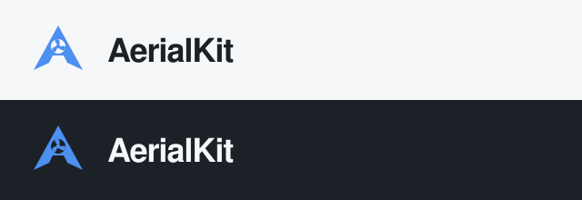

# AerialKit branding

The selected logo is **01 Rotor A**: an A silhouette with a three-blade rotor in the counter. The original direction is the final choice; the later v2 refinement is retained only as design history.

## Assets

- [Blue symbol](../apps/configurator/public/brand/aerialkit-rotor-a.svg)
- [White symbol](../apps/configurator/public/brand/aerialkit-rotor-a-white.svg)
- [Ink symbol](../apps/configurator/public/brand/aerialkit-rotor-a-ink.svg)
- [Light-background wordmark](../apps/configurator/public/brand/aerialkit-rotor-a-logo-light.svg)
- [Dark-background wordmark](../apps/configurator/public/brand/aerialkit-rotor-a-logo-dark.svg)

Use the white mark on dark backgrounds and the ink mark on light backgrounds. Keep the geometry intact and allow space around it. The blue is `#4c90f0`; assets are editable SVGs. The app header uses the mark at 32 px and its favicon uses the same original design.

For sizing, application wiring and retained explorations, see the [component brand guide](../apps/configurator/docs/BRANDING.md).
