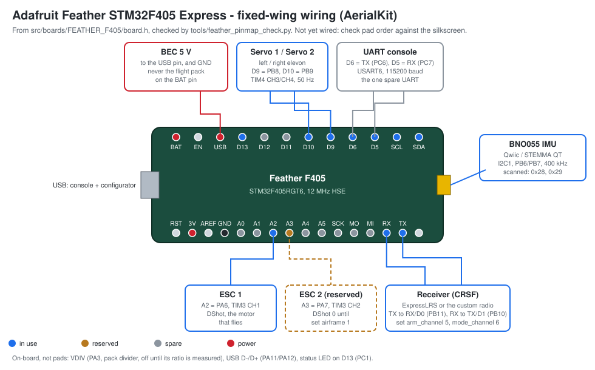

# 34 — The Feather F405's pin map, for the fixed wing

Written 2026-10-05 for the owner's goal: a fixed wing on the **Adafruit Feather
STM32F405 Express** with a **BNO055** IMU, **one ESC now and a second reserved**,
**two servos**, an **ExpressLRS (CRSF) receiver**, and **our custom radio**.
This page is what the aircraft is wired from.

**Nothing on this page has been wired.** It is the firmware's assignment, read
from the board header, checked against the pads Adafruit brought out. Which way
a servo moves, whether a pad carries the signal it is supposed to, and whether
the ESC arms on it are all the bench's to answer, with the props off.

## Where the truth is

`src/boards/FEATHER_F405/board.h` is the single source of truth for every pin
the firmware drives. This page is a reading of it, and **`make boards-check`
holds the two together** (`tools/feather_pinmap_check.py`):

- every pin macro in the header appears in the table below on the same MCU pin,
  and every macro the table names exists in the header on that pin;
- every pin the header assigns reaches a Feather pad - the header pads in
  Adafruit's own variant file (`variant_FEATHER_F405.h` in ST's Arduino core,
  sha1 `bf039d9b`, fetched 2026-10-05), or one of the three on-board
  connections the firmware uses (the USB connector and the battery divider);
- no two rows in use share a pad unless both are lines of one I2C bus, and no
  pad called spare is one the header assigns.

`tools/board_resources.py` says it does not check "whether the pin reaches the
pad"; for this board, that check now exists.

## The table

<!-- pinmap:begin -->
| pad | MCU pin | function | macro | peripheral | status |
| --- | --- | --- | --- | --- | --- |
| A2 | PA6 | ESC 1 (DShot), the motor that flies | `AK_BOARD_MOTOR1_PIN` | TIM3 CH1, AF2; DMA1 stream 4 ch 5 burst | used |
| A3 | PA7 | ESC 2 (DShot), reserved: held at DShot 0 until airframe 1 | `AK_BOARD_MOTOR2_PIN` | TIM3 CH2, AF2 | reserved |
| D9 | PB8 | servo 1, left elevon | `AK_BOARD_SERVO1_PIN` | TIM4 CH3, AF2 | used |
| D10 | PB9 | servo 2, right elevon | `AK_BOARD_SERVO2_PIN` | TIM4 CH4, AF2 | used |
| D0 | PB11 | receiver in: ELRS or the custom radio, CRSF (its TX goes here) | `AK_BOARD_RC_RX` | USART3 RX, AF7, interrupt | used |
| D1 | PB10 | receiver out (to the receiver's RX: telemetry) | `AK_BOARD_RC_TX` | USART3 TX, AF7 | used |
| SCL | PB6 | IMU clock (BNO055 on the Qwiic connector) | `AK_BOARD_IMU_SCL` | I2C1 SCL, AF4, 400 kHz | used |
| SDA | PB7 | IMU data | `AK_BOARD_IMU_SDA` | I2C1 SDA, AF4 | used |
| SCL | PB6 | barometer clock, same bus (not fitted) | `AK_BOARD_BARO_SCL` | I2C1 SCL | used |
| SDA | PB7 | barometer data, same bus (not fitted) | `AK_BOARD_BARO_SDA` | I2C1 SDA | used |
| D6 | PC6 | UART console TX (the one spare UART if a second receiver is ever wanted) | `AK_BOARD_CONSOLE_TX` | USART6 TX, AF8 | used |
| D5 | PC7 | UART console RX | `AK_BOARD_CONSOLE_RX` | USART6 RX, AF8 | used |
| D13 | PC1 | status LED, active high | `AK_BOARD_LED_PIN` | GPIO | used |
| VDIV | PA3 | pack voltage divider (ratio unmeasured, so off) | `AK_BOARD_VBAT_PIN` | ADC1 IN3 | on-board |
| USB D- | PA11 | USB console and configurator | `AK_BOARD_USB_DM` | OTG_FS | on-board |
| USB D+ | PA12 | USB console and configurator | `AK_BOARD_USB_DP` | OTG_FS | on-board |
| A0 | PA4 | - | - | ADC12 IN4, DAC1 | spare |
| A1 | PA5 | - (the natural current-sensor input) | - | ADC12 IN5, TIM2 CH1 | spare |
| A4 | PC4 | - | - | ADC12 IN14 | spare |
| A5 | PC5 | - | - | ADC12 IN15 | spare |
| D11 | PC3 | - | - | GPIO, ADC123 IN13 | spare |
| D12 | PC2 | - | - | GPIO, ADC123 IN12 | spare |
| SCK | PB13 | - (an SPI gyro, later) | - | SPI2 SCK | spare |
| MISO | PB14 | - | - | SPI2 MISO | spare |
| MOSI | PB15 | - | - | SPI2 MOSI | spare |
<!-- pinmap:end -->

## The serial ports, and why the custom radio shares the receiver's

The Feather brings out exactly three UARTs' worth of pads, from the variant
file's `PinMap_UART_TX/RX`:

| UART | pads | what it is |
| --- | --- | --- |
| USART3 | D1/D0 (PB10/PB11) | **the receiver** - ExpressLRS or the custom radio. The arch layer's receive path has interrupt handlers for USART1 and USART3 only (`src/arch/stm32f405/usart.c`), and a 420 kbaud CRSF stream needs one |
| USART6 | D6/D5 (PC6/PC7) | the UART console, polled |
| USART1 | SCL/SDA (PB6/PB7) | **not usable**: the same two pads are the Qwiic I2C bus the BNO055 is on |

USART1's usual pads (PA9/PA10) are tied to +3V3 on this board, USART2 needs PA2
(not broken out) and PA3 (the battery divider), and UART4/UART5 are on the SD
card's pads.

**The custom radio speaks CRSF, so it shares D0/D1** (milestone 4, 2026-10-05).
"Our custom radio" is the ESP-NOW link in the public aerial-kit repository
(`firmware/legacy/espnow`), and its receiver does not use a private format
toward the flight controller: it outputs CRSF by default (or SBUS, PPM, iBus or
S.Port, by `OUTPUT_PROTOCOL` in its `config.h`), 26-byte RC frames at
420 000 baud, 100 Hz - exactly what ExpressLRS sends. So the aircraft carries
**one receiver at a time** on USART3, `rc_protocol 0` for either, and USART6
stays the console. That replaces milestone 3's plan to move the custom radio to
USART6: the plan said milestone 4 would decide from the radio's own
specification, and the specification is CRSF. USART6 remains the one spare UART
if both receivers are ever wanted at once, which would need its receive
interrupt added to the arch layer.

**Two things either radio needs, both found in milestone 4:**

- **`set arm_channel 5` and `set mode_channel 6`.** Both radios put the arm
  switch on CH5 (AUX1); this firmware's default arm channel is CH6 and its mode
  switch CH5, so with the defaults either radio's arm switch selects angle mode
  and never arms (`docs/04-flight-core.md`, the arm gates).
- **The custom radio's encoder drops bits of the pitch channel.** Its
  `packRcChannels` masks CH2 with `& 0x07` where CRSF needs `& 0x1F` (and CH7
  with `& 0x3` where it needs `& 0x3F`), so pitch arrives with up to 24 counts
  of error. No flight controller can recover bits that were never sent: the fix
  is those two masks in the radio's `crsf_bridge.cpp`
  (`tests/test_custom_radio.c` pins the defect and shows the corrected masks
  make all sixteen channels exact). **Fly the custom radio only after that fix.**

## Timers, DMA and interrupts - what is taken and what clashes

| resource | taken by | note |
| --- | --- | --- |
| TIM3 CH1/CH2 | ESC 1, ESC 2 (A2, A3) | the DShot burst: DMA1 stream 4, channel 5, `DMA1_Stream4_IRQHandler`. CH3/CH4 would be PB0/PB1, **not on this header** - which is why the board has two motors, not four |
| TIM4 CH3/CH4 | servo 1, servo 2 (D9, D10) | 50 Hz servo PWM. TIM4 CH1/CH2 are the SCL/SDA pads, so they must stay unused as timer outputs |
| USART3 | receiver (D0, D1) | `USART3_IRQHandler` |
| USART6 | console (D5, D6) | polled; the one spare UART. Also TIM3 CH1/CH2 and TIM8 CH1/CH2 alternates on these pads, which nothing uses |
| I2C1 | BNO055 (and a barometer, if fitted) on the Qwiic connector | the same pads are USART1 and TIM4 CH1/CH2 alternates |
| ADC1 IN3 | pack divider (VDIV, on-board) | off until the divider ratio is measured |
| OTG_FS | USB console | soft-disconnected until the main loop starts |

**Bidirectional DShot** (roadmap phase 3) reads the ESC's reply on the same
TIM3 pads by switching them to input capture, so it adds no pad - but it has
not been run on this board (no bidirectional-DShot ESC on a wire yet).

## Wiring the aircraft

General Feather facts the firmware cannot check, worth reading before plugging
anything in:

- **Never put the flight pack on the Feather's BAT pin.** That JST input is for
  a 1S LiPo and its charger. Feed the Feather from a **5 V BEC to the USB pin**
  (or USB itself on the bench).
- **Servos are powered from the BEC**, not from the Feather's 3V3 regulator.
  Signal to D9/D10, ground common with the Feather.
- **ESC 1**: signal to **A2**, ground to the Feather's GND. ESC 2, when fitted,
  to **A3** - and `set airframe 1` (the twin, with differential thrust).
- **Receiver - ExpressLRS or the custom radio, one at a time**: 5 V and GND
  from the BEC, **its TX to D0**, **its RX to D1**. `rc_protocol 0` is CRSF and
  is the default; `set arm_channel 5` and `set mode_channel 6` for either.
- **BNO055**: on the Qwiic/STEMMA connector. The board scans 0x28, 0x29, 0x6B,
  0x6A at boot and the `imu:` line names the part and the address that
  answered (`docs/20-i2c.md`).

## What this page does not claim

- No pad has carried a DShot frame, a servo pulse or a CRSF byte on this board.
- The pad positions in the diagram follow the Feather form factor's header
  order; the labels are the variant file's. Check them against the silkscreen
  before soldering.
- The variant file was read from the stm32duino repository's main branch on
  2026-10-05 and is identified by its sha1, not by a pinned commit.
